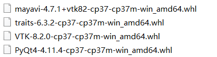

<p align="center">
  <strong>Python三体模拟器</strong>
</p> 

# 介绍
《三体》是刘慈欣创作的长篇科幻小说，文中提到的三体问题比较复杂和无解。
该项目代码就是利用 Python 来模拟三体的运行，此项目代码完全共享，欢迎下载。

我们可以自己通过调整天体的初始坐标、质量和矢量速度等等参数来自定义各种场景来控制天体的运行效果。


# 抖音课堂：


# 课程下载
https://gitcode.net/pythoncr/three_body_sim

# 目录说明

**bodies** 天体类、包含太阳以及太阳系中的所有行星
 
**common** 公共库代码
  
**data** 构建天体的 JSON 数据
   
**scenes**  各种天体系统运行场景 **演示入口**

**textures**  天体纹理图片

**simulators** 天体系统运行模拟器
    
**images** 图片

# 安装 Python 库
按照您电脑上的 Python 环境版本下载安装包（我的电脑版本为：Python3.7）
1. pyqt4 (4.11.4)
https://www.lfd.uci.edu/~gohlke/pythonlibs/#pyqt4

2. vtk   8.2.0
https://www.lfd.uci.edu/~gohlke/pythonlibs/#vtk

3. traits 6.3.2
https://www.lfd.uci.edu/~gohlke/pythonlibs/#traits

4. mayavi 4.7.1
https://www.lfd.uci.edu/~gohlke/pythonlibs/#mayavi



需要的安装包顺序如下：
pyqt4、vtk、traits、mayavi
```shell script
cd e:\three_body_sim\packages
pip install PyQt4-4.11.4-cp37-cp37m-win_amd64.whl
pip install VTK-8.2.0-cp37-cp37m-win_amd64.whl
pip install traits-6.3.2-cp37-cp37m-win_amd64.whl
pip install mayavi-4.7.1+vtk82-cp37-cp37m-win_amd64.whl
```

# 模拟场景运行
```shell script
cd e:\three_body_sim\
# 从运行demo开始
python scences/demo.py

# 三体场景
# 3个太阳、1个地球（效果1）
python scenes/three_body_01.py

# 3个太阳、1个地球（效果2）
python scenes/three_body_02.py

# 太阳系场景
# 以下展示的效果为太阳系真实的距离
# 由于宇宙空间尺度非常大，如果按照实际的天体大小，则无法看到天体，因此需要对天体的尺寸进行放大
python scenes/solar_system_1.py

# 以下展示的效果非太阳系真实的距离和大小
# 1、由于宇宙空间尺度非常大，如果按照实际的天体大小，则无法看到天体，因此需要对天体的尺寸进行放大
# 2、为了达到最佳的显示效果，对每个行星天体的距离进行了缩放
python scenes/solar_system_2.py

# 以下展示的效果非太阳系真实的距离和大小
# 1、由于宇宙空间尺度非常大，按照实际的大小无法看到行星天体，因此需要对天体的尺寸进行放大
# 2、为了达到最佳的显示效果，对每个行星天体的距离进行了缩放
# 3、加入了小行星的演示效果
python scenes/solar_system_3.py

# 太阳、地球运行效果
python scenes/sun_earth.py

# 太阳、地球、木星运行效果
python scenes/sun_earth_jupiter.py 
```


--------------------
安装 
mayavi
pip install -i https://pypi.douban.com/simple PyQt5 pyqt5-tools

Step 1：下载所需要的安装包
【链接网址】http://www.lfd.uci.edu/~gohlke/pythonlibs/
另外我已经把依赖包放入 百度云，有需要的小伙伴可以私信找我。
我的python环境是python3.6
需要的安装包顺序为：


Step 2：进行安装包安装
下载对应的版本，利用pip进行安装。

pip install xxx.whl
--------------------

# 免责声明
* 本项目开源代码和资料主要用于教学，任何直接或间接因使用我方的任何内容所导致的全部后果与我方无关，若使用者无法对使用我方内容后的任何后果负责，请不要使用我方的任何内容。若我方的任何内容侵犯了您的法律权益，请联系pythoncr@126.com，作者会第一时间删除侵权内容。

```shell script
(mayavi) e:\three_body_sim\packages>pip install PyQt4-4.11.4-cp37-cp37m-win_amd64.whl
Processing e:\three_body_sim\packages\pyqt4-4.11.4-cp37-cp37m-win_amd64.whl
Installing collected packages: PyQt4
Successfully installed PyQt4-4.11.4

(mayavi) e:\three_body_sim\packages>pip install VTK-8.2.0-cp37-cp37m-win_amd64.whl
Processing e:\three_body_sim\packages\vtk-8.2.0-cp37-cp37m-win_amd64.whl
Installing collected packages: VTK
Successfully installed VTK-8.2.0

(mayavi) e:\three_body_sim\packages>pip install traits-6.3.2-cp37-cp37m-win_amd64.whl
Processing e:\three_body_sim\packages\traits-6.3.2-cp37-cp37m-win_amd64.whl
Installing collected packages: traits
Successfully installed traits-6.3.2

(mayavi) e:\three_body_sim\packages>
(mayavi) e:\three_body_sim\packages>pip install mayavi-4.7.1+vtk82-cp37-cp37m-win_amd64.whl
Processing e:\three_body_sim\packages\mayavi-4.7.1+vtk82-cp37-cp37m-win_amd64.whl
Requirement already satisfied: vtk in c:\programdata\anaconda3\lib\site-packages (from mayavi==4.7.1+vtk82) (8.2.0)
Collecting pyface>=6.1.1 (from mayavi==4.7.1+vtk82)
  Downloading https://files.pythonhosted.org/packages/35/e4/39e0ed023382c35f5a13630f33d81b467c0b0dd58ec4e06998eadb665637/pyface-7.4.4-py3-none-any.whl (1.3MB)
     |████████████████████████████████| 1.3MB 344kB/s
Collecting traitsui>=6.0.0 (from mayavi==4.7.1+vtk82)
  Downloading https://files.pythonhosted.org/packages/6b/ea/392eaa31cac6182c9e6eb01714579221d3636630ed4f20f0b6d0ae3fd606/traitsui-7.4.3-py3-none-any.whl (1.5MB)
     |████████████████████████████████| 1.5MB 6.4MB/s
Collecting apptools (from mayavi==4.7.1+vtk82)
  Downloading https://files.pythonhosted.org/packages/b1/6a/04d263d0f14e549a60112b498057a9736c62f77324974d9a860086367199/apptools-5.2.0-py3-none-any.whl (229kB)
     |████████████████████████████████| 235kB 6.8MB/s
Requirement already satisfied: numpy in c:\programdata\anaconda3\lib\site-packages (from mayavi==4.7.1+vtk82) (1.15.0)
Requirement already satisfied: traits>=4.6.0 in c:\programdata\anaconda3\lib\site-packages (from mayavi==4.7.1+vtk82) (6.3.2)
Requirement already satisfied: pygments in c:\programdata\anaconda3\lib\site-packages (from mayavi==4.7.1+vtk82) (2.4.2)
Collecting envisage (from mayavi==4.7.1+vtk82)
  Downloading https://files.pythonhosted.org/packages/8f/4d/52b6f88b08dad56e26a1e485a0139312227d415ffbfb1be60be7464bf28e/envisage-6.1.1-py3-none-any.whl (281kB)
     |████████████████████████████████| 286kB 6.4MB/s
Collecting importlib-resources>=1.1.0; python_version < "3.9" (from pyface>=6.1.1->mayavi==4.7.1+vtk82)
  Downloading https://files.pythonhosted.org/packages/be/0f/bd3e7fa47cc43276051c557d3b2fe946664781d2ecf08b05d074e1a3ee59/importlib_resources-5.10.2-py3-none-any.whl
Requirement already satisfied: importlib-metadata>=3.6.0; python_version < "3.8" in c:\programdata\anaconda3\lib\site-packages (from pyface>=6.1.1->mayavi==4.7.1+vtk82) (4.12.0)
Collecting configobj (from apptools->mayavi==4.7.1+vtk82)
  Downloading https://files.pythonhosted.org/packages/d3/bb/d10e531b297dd1d46f6b1fd11d018247af9f2d460037554bb7bb9011c6ac/configobj-5.0.8-py2.py3-none-any.whl
Requirement already satisfied: setuptools in c:\programdata\anaconda3\lib\site-packages (from envisage->mayavi==4.7.1+vtk82) (41.4.0)
Collecting zipp>=3.1.0; python_version < "3.10" (from importlib-resources>=1.1.0; python_version < "3.9"->pyface>=6.1.1->mayavi==4.7.1+vtk82)
  Downloading https://files.pythonhosted.org/packages/95/7b/1608a7344743f54a8c072d64d2a279934fd204d6d015278b0a0ed4ce104b/zipp-3.13.0-py3-none-any.whl
Requirement already satisfied: typing-extensions>=3.6.4; python_version < "3.8" in c:\programdata\anaconda3\lib\site-packages (from importlib-metadata>=3.6.0; python_version < "3.8"->pyface>=6.1.1->mayavi==4.7.
1+vtk82) (3.7.4.3)
Requirement already satisfied: six in c:\programdata\anaconda3\lib\site-packages (from configobj->apptools->mayavi==4.7.1+vtk82) (1.15.0)
Installing collected packages: zipp, importlib-resources, pyface, traitsui, configobj, apptools, envisage, mayavi
  Found existing installation: zipp 0.6.0
    Uninstalling zipp-0.6.0:
      Successfully uninstalled zipp-0.6.0
Successfully installed apptools-5.2.0 configobj-5.0.8 envisage-6.1.1 importlib-resources-5.10.2 mayavi-4.7.1+vtk82 pyface-7.4.4 traitsui-7.4.3 zipp-3.13.0

```